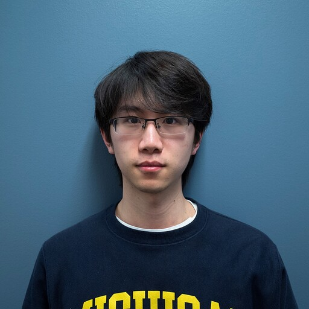
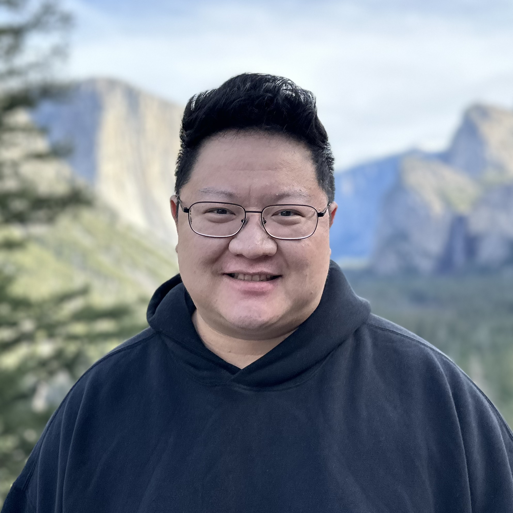

<!-- Add this CSS to control appearance -->

<!--  -->

Following the strong momentum and community engagement demonstrated during [DuckAI 2025 Spring](https://duck-ai-stevens.github.io/2025-spring/), the 2nd iCNS/ECE Symposium on AI Research and Innovations (DuckAI 2025 Fall), scheduled on **December 10th 2025**, continues to expand our research and educational mission. This one-day event is organized by the [Center for Innovative Computing and Networked Systems (iCNS)](https://www.stevens.edu/icns-center-for-innovative-computing-and-networked-systems) and the [Department of Electrical and Computer Engineering](https://www.stevens.edu/school-engineering-science/departments/electrical-computer-engineering) at Stevens. It aims to bring together industry partners, researchers, faculty, and students to discuss recent developments in AI techniques and applications. The symposium features two technical sessions with invited talks, along with a poster & demo session where around 30 student teams will showcase their AI projects for Fall’25. The event is open to the public with free registration.

<!-- ## Event Agenda

- Schedule on **Wednesday, December 10, 2025**
- 9:00 a.m. – 4:00 p.m.
- Morning session (talk session): **Howe 409 (Bissinger)**
- Afternoon session (poster session): **Library B-12** -->

<!--

## Agenda

- 9:00 AM - Check in
- 9:15 AM - Opening Remarks by ECE Department Chair: Dr. Min Song
- 9:30 AM - Invited Talk Session 1 - Host: Dr. Hao Wang
- 10:20 AM - Coffee Break
- 10:40 AM - Invited Talk Session 2 - Host: Dr. Shucheng Yu
- 11:30 AM - Lunch
- 1:00 PM - Student Project Poster & Demo
- 2:30 PM - Award announcement
- 3:00 PM - Adjourn -->

Registration link: [https://forms.gle/2A2kscme9qP74CBHA](https://forms.gle/2A2kscme9qP74CBHA)

You can also register by scanning the QR code:

## Invited Speakers

    <ul class="responsive-table" style="margin-left: 0; border-bottom: 0.1em solid whitesmoke;">
        <li class="table-row">
            

                

                    
                

            

            

                
<b><a href="https://www.linkedin.com/in/soumitraj/">Soumitra Siddharth J.</a></b> | Machine Learning, Apple 

                <b>ML Systems & Complexities of Modern Enterprise ML Platforms</b>
                

                    
Majority of ML projects stall at production stage of model development life cycle, they can fail because of many reasons such as : inadequate data pipelines, operational complexities, feature management challenges, model decay, or organizational misalignment between data science and engineering teams. This talk explores ML Platform foundations for enterprise systems, covering feature engineering pipelines, model serving architectures, experiment tracking, MLOps frameworks, production deployment patterns, and organizational challenges in scaling ML across organizations.

                    
<b>Short Bio:</b> Soumitra is a currently working as a Machine Learning Manager at Apple, where he is leading machine learning engineers and software developers to build the Machine Learning Platform at Apple Ads. His interests lie at the intersection of distributed computing, big data processing, artificial intelligence and machine learning. He is currently pursuing MBA from University of Illinois, Urbana Champaign and holds M.S. in Computer Engineering from University of Florida, Gainesville. Linkedin : https://www.linkedin.com/in/soumitraj/

                

                <button class="expand-btn" onclick="toggleContent(this)">More</button>
            

        </li>
        <li class="table-row">
            

                

                    
                

            

            

                
<b><a href="https://research.nvidia.com/person/yulong-cao">Yulong Cao</a></b> | Autonomous Driving, NVIDIA 

                <b>Towards Safe and Human-aligned Autonomous Driving</b>
                

                    
Ensuring the security and safety of autonomous driving systems is a critical challenge due to the inherent safety risks. Building safe and human-aligned autonomous driving systems in real-world scenarios remains unresolved due to the complex and varied nature of driving behaviors and semantics. In this talk, I will present recent research efforts aimed at rethinking the testing of AV systems. The discussion will focus on two key areas: 1) modeling diverse behaviors using advanced traffic models, and 2) leveraging foundation models to enhance simulation capabilities and accelerate the testing process.

                    
<b>Short Bio:</b> Yulong Cao is a research scientist at the NVIDIA Autonomous Vehicle Research group directed by Marco Pavone. His research interest is in the intersection of security, privacy, and machine learning. His research goal is to build trustworthy machine learning systems that are aligned with human in the real world, with a focus on autonomous driving systems. He completed his Ph.D from the Computer Science and Engineering department of University of Michigan, advised by Morley Mao. and holds B.S. degrees from University of Michigan and Shanghai Jiao Tong University.

                

                <button class="expand-btn" onclick="toggleContent(this)">More</button>
            

        </li>
        <li class="table-row">
            

                

                    
                

            

            

                
<b><a href="https://derek.ma/">Mingyu Derek Ma</a></b> | Prescient Design, Genentech 

                <b>Elevating Large Language Models to Expert Intelligence</b>
                

                    
Large Language Models (LLMs) have been applied to expert domains and scientific contexts, such as clinical diagnosis and drug discovery. However, the generalizability that characterizes LLMs in the general domain does not readily translate to scientific and expert tasks. Unlike general natural language tasks, scientific data is densely packed, homogeneous, and less self-explanatory. Moreover, expert-level tasks, such as those performed by physicians, engineers, or scientists, require deep domain knowledge, intuitive reasoning, and multi-step planning, refined through years of specialized training. In this talk, I will first discuss capturing implicit expert intuition for individual decision-making, using clinical diagnosis prediction as a case study. I will then extend the focus to compositional, project-level reasoning and automation, highlighting the development of LLM agents for scientific discovery.

                    
<b>Short Bio:</b> Mingyu Derek Ma is a Senior Machine Learning Scientist at Prescient Design, Genentech (Roche), where he leads the development of agentic intelligence and automation platforms for drug discovery and contributes to training scientific large language models. His work focuses on the architecture, training, and agentic use of generative language models inspired by and applied to clinical, medical, and scientific scenarios. His research has been recognized as one of the top 15 most-cited papers at NAACL 2024 and has been published at leading AI conferences like ACL, AAAI, and NeurIPS. He obtained his PhD in Computer Science from UCLA and received the J.P. Morgan Chase AI PhD Fellowship and Amazon Fellowship.

                

                <button class="expand-btn" onclick="toggleContent(this)">More</button>
            

        </li>
    </ul>

## Organizers:

- [Hao Wang](https://intellisys.haow.us/haowang/)
- [Joseph Helsing](https://www.stevens.edu/profile/jhelsing)
- [Min Song](https://www.stevens.edu/profile/msong6)
- Jessica Gruich
- [Kevin Lu](https://www.stevens.edu/profile/klu2)

## Volunteers:

- [Rui Wei](https://me.waynetech.site/)
- Qingyang Yu
- Hao (Lucas) Wang
- Xuan Li

<!-- ## Special Thanks -->

<!--
**Important Dates:**
* ~~Submission deadline: April 1, 2025~~
* ~~Acceptance notification: April 15, 2025~~
* Final version: May 30, 2025
* PER Camera ready: June 30, 2025
* Workshop date: June 13, 2025 -->

<!-- ## Moments at DuckAI 2025 Fall -->
